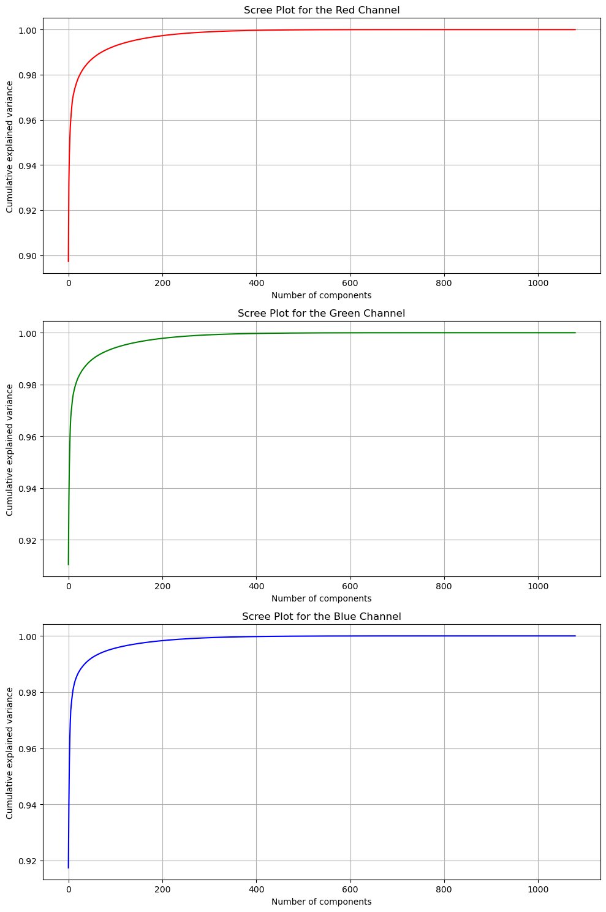
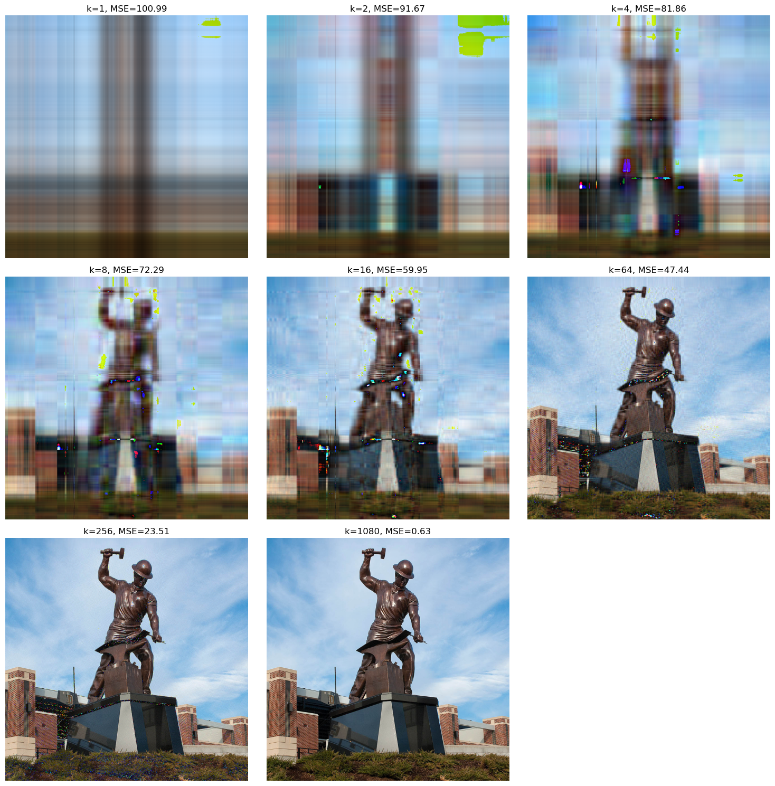
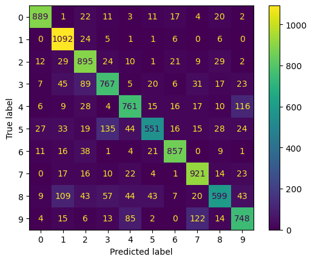
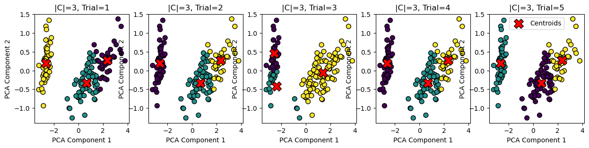

# Build ML Algorithms From Scratch

## Overview
This repository contains five distinct data science projects, each focusing on a different machine learning technique applied to various datasets. These projects encompass techniques from image processing to classification and clustering, demonstrating the application of fundamental algorithms in solving real-world problems.

### Projects List:
1. **SVD Image Compression and Reconstruction**
2. **Gaussian Naive Bayes Classifier on the MNIST Dataset**
3. **One-vs-All Logistic Regression Ensemble on the MNIST Dataset**
4. **K-means Clustering on the Iris Dataset**
5. **Color Quantization using K-means** — lives inside `K-means/K-means.ipynb`, not a separate folder

### Notebooks
| # | Notebook |
|---|---|
| 1 | `SVD Image Compression and Reconstruction/Singular Value Decomposition.ipynb` |
| 2 | `Gaussian Naive Bayes Classifier on the MNIST Dataset/Gaussian Naive Bayes Classifier.ipynb` |
| 3 | `One-vs-All Logistic Regression Ensemble on the MNIST Dataset/One-vs-All Logistic Regression Ensemble.ipynb` |
| 4, 5 | `K-means/K-means.ipynb` |

Each folder also holds a PDF export of its notebook. Nothing needs downloading —
but the data does not sit where the notebooks look for it, so see
[Installation and Usage](#installation-and-usage) before running anything:

| Notebook | Path it reads | Where the file actually is |
|---|---|---|
| Gaussian Naive Bayes | `./mnist_train.csv`, `./mnist_test.csv` | inside `data.zip`, which unpacks to `data/mnist_train.csv` |
| One-vs-All Logistic Regression | `./mnist_train.csv`, `./mnist_test.csv` | as above |
| SVD | `purdue.jpg` | `SVD Image Compression and Reconstruction/purdue.jpg` ✅ |
| K-means / colour quantization | `./hw4_data/hw4_purdue.jpg` | `K-means/hw4_purdue.jpg` — there is no `hw4_data/` directory |

### Requirements
`numpy`, `scipy`, `matplotlib`, `scikit-learn`, `Pillow`, `jupyter`.

### What "from scratch" covers

It is not uniform across the five projects, so here is the scope of each:

| # | Project | Implemented here | Taken from a library |
|---|---|---|---|
| 1 | SVD compression | rank-k reconstruction, MSE, scree plots | the decomposition itself — `np.linalg.svd` |
| 2 | Gaussian Naive Bayes | the classifier: `fit`, `predict`, per-class covariance, smoothing | the Gaussian density — `scipy.stats.multivariate_normal` |
| 3 | One-vs-All Logistic Regression | data loading and per-class evaluation | **the model — `sklearn.linear_model.LogisticRegression(multi_class='ovr')`** |
| 4 | K-means on Iris | `class KMeans` — `fit`, `predict`, `fit_predict` | `load_iris`, `PCA` for plotting, `GaussianMixture` as a comparison |
| 5 | Color quantization | the same hand-written `KMeans`, applied to pixels | — |

**Project 3 is the exception.** scikit-learn fits the ten binary models through its own
one-vs-rest wrapper; the notebook does not implement logistic regression. Projects 2, 4
and 5 are hand-written classifiers, and project 1 builds everything around NumPy's
decomposition.

---

## 1. SVD Image Compression and Reconstruction

### Objective
To build an image compression pipeline on top of Singular Value Decomposition — rank-k
reconstruction, MSE and scree plots written directly against NumPy — and understand the
trade-off between image quality and data reduction. The decomposition itself is
`np.linalg.svd`; see [What "from scratch" covers](#what-from-scratch-covers).

### Methodology
- Decomposed images into RGB channels and performed SVD on each channel separately.
- Explored different numbers of singular values to examine their impact on the image quality.
- Calculated Mean Squared Error (MSE) to quantify the loss from the original image.

### Results
- Reconstructed at k = 1, 2, 4, 8, 16, 64, 256 and 1080 singular values. MSE against
  the original falls from 100.99 at k=1 to 0.63 at k=1080.
- Most of the signal sits in the leading components: cumulative explained variance is
  already above 0.90 at the first component on all three channels and has flattened
  well before 200.


*Cumulative explained variance for the red, green and blue channels.*

<details>
<summary>Rank-k reconstructions, each panel labelled with its MSE (2.3 MB image)</summary>



</details>

---

## 2. Gaussian Naive Bayes Classifier on the MNIST Dataset

### Objective
To develop a Gaussian Naive Bayes classifier from scratch and apply it to classify handwritten digits from the MNIST dataset.

### Methodology
- Implemented Gaussian distribution calculations for each class.
- Applied smoothing techniques to avoid numerical instability.
- Evaluated model performance across different smoothing parameters using accuracy and a confusion matrix.

### Results
- Smoothing swept over {0.001, 0.01, 0.1, 1, 10, 100}. Test accuracy across the sweep
  ranges from 78.38% to 80.80%, i.e. one-zero error 21.62% down to 19.20%.
- The confusion matrix shows the errors are not spread evenly: 5→3 (135), 9→7 (122),
  4→9 (116) and 8→1 (109) account for much of the loss.


*Ten-class confusion matrix for the best smoothing setting.*

---

## 3. One-vs-All Logistic Regression Ensemble on the MNIST Dataset

### Objective
Classify MNIST digits with a one-vs-all logistic regression ensemble, and measure how the
ten binary models compare with the combined ten-class result. The models are fitted by
scikit-learn, not implemented here — the work in this notebook is the data pipeline and
the per-class evaluation.

### Methodology
- Fitted `sklearn.linear_model.LogisticRegression(multi_class='ovr')`, which trains one
  binary model per digit internally. This project uses scikit-learn's implementation
  rather than a hand-written one.
- Evaluated each class separately, then measured the combined ten-class result.

> `multi_class='ovr'` was deprecated in scikit-learn 1.5 and removed in 1.7. To re-run
> this notebook on a current version, use `OneVsRestClassifier(LogisticRegression())`.

### Results
- Per-class one-vs-rest accuracy ranges from 96.11% (class 8) to 99.36% (class 1).
- The combined ten-class ensemble reaches 92.12% accuracy, one-zero error 7.88%.
- Note these two figures are not directly comparable: the per-class numbers are binary
  one-vs-rest accuracies, the ensemble number is over all ten classes.

---

## 4. K-means Clustering on the Iris Dataset

### Objective
To implement K-means clustering from scratch and apply it to the Iris dataset to identify distinct groups based on flower characteristics.

### Methodology
- Conducted clustering with varying numbers of clusters.
- Used PCA for dimensionality reduction to visualize clusters.
- Compared clustering results against the known labels from the Iris dataset.

### Results
- Five random restarts at |C|=3, plotted in PCA space against the known Iris labels.
- Four restarts converge to the same partition; one does not — a plain illustration of
  K-means' sensitivity to initialisation rather than a defect in the implementation.


*Five random restarts at |C|=3 in PCA space, centroids marked in red.*

---

## 5. Color Quantization using K-means

### Objective
To reduce the number of distinct colors in an image using K-means clustering, aiming to maintain as much of the image's visual quality as possible.

### Methodology
- Clustering pixel values to reduce color variance while retaining visual similarity.
- Applied different numbers of clusters to observe the impact on image quality and file size.

### Results
- Quantized the image at several palette sizes using the same hand-written `KMeans`,
  with the quantized images plotted side by side against the original.
- The comparison is visual only — the notebook records no reconstruction error or
  file-size measurement for this project.

---

## Installation and Usage
```bash
pip install numpy scipy matplotlib scikit-learn Pillow jupyter
jupyter notebook
```
Open any of the notebooks listed above and run it top to bottom — after putting the data
where the notebook expects it. The paths in the notebooks do not match the layout in this
repository, so two of them need a step first:

```bash
# MNIST projects — the archive unpacks into data/, the notebooks read ./
cd "Gaussian Naive Bayes Classifier on the MNIST Dataset"   # and again for the One-vs-All folder
unzip -o data.zip && mv data/mnist_*.csv . && rm -rf data __MACOSX

# K-means / colour quantization — the notebook reads ./hw4_data/hw4_purdue.jpg
cd K-means && mkdir -p hw4_data && cp hw4_purdue.jpg hw4_data/
```

The SVD notebook needs no setup: it reads `purdue.jpg` from its own folder.

---

## Conclusion
These projects were written to understand the algorithms from the inside rather than to
beat a benchmark. Gaussian Naive Bayes and K-means are implemented here in full; the SVD
project builds its compression pipeline around NumPy's decomposition; the one-vs-all
ensemble uses scikit-learn and is the exception, kept in the set because the per-class
versus ten-class comparison is the point of it. The scope of each is set out in
[What "from scratch" covers](#what-from-scratch-covers).

---
